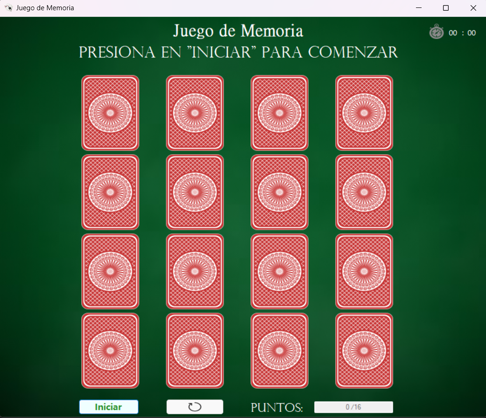

# 🧠🔎 Juego de memoria en Visual Basic

### 📗Descripción:

Consiste en un juego en el programa Visual Studio 2022,
haciendo uso del lenguaje de programación Visual Basic en aplicaciones de Windows Form (.NET
Framework) y las herramientas que esto ofrece para el desarrollo de aplicaciones de escritorio.

El juego se basa en el “Juego de Memoria” y consiste en un programa el cual muestra una serie de
cartas, pero por el lado de detrás, en total hay 16 cartas de las cuales hay 8 repetidas
por ende se trata de ir volteando cada carta hasta que se encuentren las 8 parejas de cartas iguales.

### ✏️ Reglas:

Se deben armar parejas de las cartas que sean exactamente iguales para ganar los dos puntos de
los 16pts totales, en caso de fallar las cartas volverán a darse la vuelta, caso contrario se mantendrán
visibles por el resto de la partida, hasta que se termine o reinicie.

Por cada dos cartas que se giren, se sumara 1 intento, esto con la finalidad de mostrar al final el
total de intentos realizados cuando termine el juego, además se le mostrara el tiempo que obtuvo, este si es visible durante el juego por medio del cronometro que se muestra en la parte
superior.

Para ganar el juego se deben alcanzar los 16pts y al lograrlo se mostrará una pequeña ventana con
algunas estadísticas de la partida, al finalizar el usuario puede decidir si reiniciar el juego para volver
a empezar de 0 con las cartas en posiciones distintas(ya que las cartas siempre tendrán una posición
aleatoria al inicio de cada partida o reinicio) o si desea cerrarlo, el botón para reiniciar el juego esta
disponible en casi todo momento y simplemente refresca la aplicación para iniciar una partida nueva
y diferente a la anterior.

### Interfaz de la aplicación

